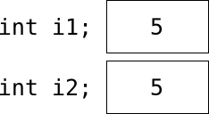
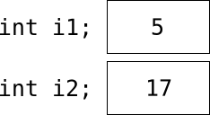
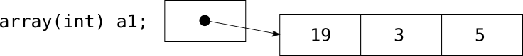
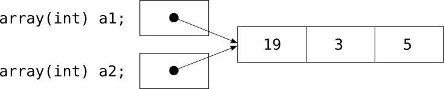
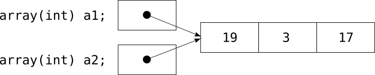
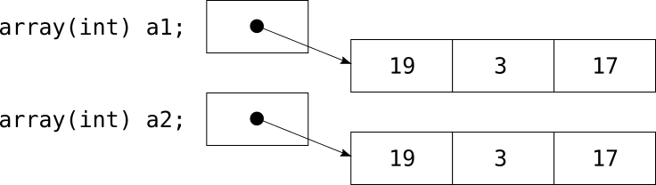

# Basic Types and Reference Types

We have said before that
a variable is a sort of box
that can be used to store a value.
But there is a difference
between what we call "basic" values, such as integers,
and more complex values, such as arrays.
The basic values are stored in the variables,
just as as we can expect, but the complex ones are not.
They are stored somewhere else,
and the variable only contains a reference to the actual data.

Usually, you don't need to think about this difference,
but there are cases when it is important.

Here is an example to show exactly what the difference means.
We start by defining an integer variable called `i1`:

```pike
int i1;
```

This variable can now be used to store integer values.
We put the value **5** in `i1`:

```pike
i1 = 5;
```

If we could look inside the computer,
this is what we would see:


*A non-reference variable*

`i1` is a box, which contains the value **5**.
We now define another integer variable, called `i2`,
and copy the value in `i1` to `i2`:

```pike
int i2;
i2 = i1;
```

This is how it looks now:



*Two non-reference variables, before the change*

As we might have expected,
there is a **5** in `i1`,
and another **5** in `i2`.
What happens if we change the value of `i2`?

```pike
i2 = 17;
```

Well, again as expected,
the value in the variable `i2` changes.
The value in `i1` of course doesn't:



*Two non-reference variables, after the change*

But with complex types, such as arrays,
things are a bit different.
To illustrate this,
we define an array variable, `a1`:

```pike
array(int) a1;
```

This variable is of the type "array(int)",
so we can use it to store arrays of integers.
So let's do just that.
We create an array,
and put that array in `a1`:

```pike
a1 = ({ 19, 3, 5 });
```

Inside the computer,
it now looks like this:



*A reference variable*

Note that `a1` doesn't actually contain the array,
it just contains a "pointer" or "reference" to the array.

What happens if we try to do
the same thing as we did with the integers above,
that is, copy the value to a new variable,
and then change the value in that new variable?

To show what happens,
we define a new array variable, `a2`,
and try to copy the array `a1` to this new variable:

```pike
array(int) a2;
a2 = a1;
```

This is where things are different.
Remember that the variable `a1` doesn't contain the real array,
but just a reference to it,
and that an expression of the type

```pike
a2 = a1;
```

means "take whatever there is in `a1`,
make a copy of it, and put that copy it in `a2`".
Because of this,
what gets stored in `a2` is a copy of the *reference*,
not of the array:



*Two reference variables, before the change*

Note that both `a1` and `a2` now point to the same array.
If we now try to change `a2`,
for example by changing the last element in `a2` from **5** to **17**:

```pike
a2[2] = 17;
```

what will change is the array pointed to by the reference in `a2`:



*Two reference variables, after the change*

If we don't think about the fact
that `a1` and `a2` just contain references,
pointing to the same array,
it would seem as if our change to the variable `a2` had,
in some mysterious way,
also changed the contents of the variable `a1`!

If we want a real copy,
and not just a reference to the same array,
we must create that copy explicitly.
We can use the function `copy_value` for this:

```pike
a2 = copy_value(a1);
```

This will create a copy of the array,
and store a reference to that copy in `a2`:



*Two reference variables, pointing to different things*

Note that `copy_value` creates a *recursive* copy,
which means that if the array contains other arrays,
it will create copies of those arrays too,
and so on.
A trick for creating a non-recursive copy of an array
is to add an empty array:

```pike
a2 = a1 + ({ });
```

The result of the expression `a1 + ({ })`
is a new array that is a copy of `a1`.

The following data types in Pike are **basic types**,
and are stored in the variables themselves:

* `int`
* `float`
* `string`

The following data types in Pike are **reference types**,
and what is stored in the variables
are just references to the data objects:

* `array`
* `mapping`
* `multiset`
* `program`
* `object`
* `function`

Note that the same difference applies to method calls.
When you send data to a method as arguments,
and when you return data as the value of the method,
what is actually sent is either the values themselves (for the basic types),
or references (for the reference types).
